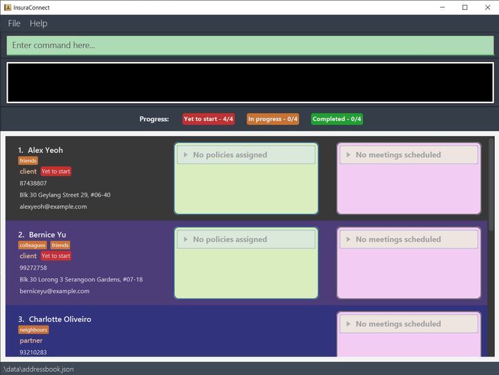

# InsuraConnect User Guide
Welcome to the user guide for InsuraConnect!

InsuraConnect is a **personal productivity booster tool for insurance agents**.

It provides fast access to client contact details, easily manage client relationships, keep track of meetings and policies, and stay organised in a fast-paced and competitive industry.

This user guide will serve to teach users in how to use InsuraConnect as well as its many features to boost your productivity.

Refer to the table of contents on the right to find your answers as well as step-by-step instructions for all the features to be a **master** of InsuraConnect.
<!-- * Table of Contents -->
<page-nav-print />

--------------------------------------------------------------------------------------------------------------------

## Quick start

1. Ensure you have Java `11` or above installed in your Computer.

1. Download the latest `InsuraConnect.jar` from [here](https://github.com/AY2324S2-CS2103T-T13-3/tp/releases).

1. Copy the file to the folder you want to use as the _home folder_ for your AddressBook.

1. Open a command terminal, `cd` into the folder you put the jar file in, and use the `java -jar InsuraConnect.jar` command to run the application. 
   A GUI similar to the below should appear in a few seconds. Note how the app contains some sample data. 
   

1. Type the command in the command box and press Enter to execute it. e.g. typing **`help`** and pressing Enter will open the help window. 
   Some example commands you can try:

   * `list` : Lists all contacts.

   * `add n/John Doe p/98765432 e/johnd@example.com a/John street, block 123, #01-01 r/client` : Adds a contact named `John Doe` to the Address Book.

   * `delete 3` : Deletes the 3rd contact shown in the current list.

   * `schedule 1 md/2024-05-05 mt/09:00 ma/Discuss health policy mdur/60` : Schedules a meeting with the first contact in the current list at 5th may 2024 9am to discuss health policy.
   * `policy 1 po/Health policy ed/2029-06-06 pm/1000` Adds a policy with the first contact in the current list with name of 
   Health policy, expiry date on the 6th of June 2029, with a premium of 1000 SGD

   * `exit` : Exits the app.

1. Refer to the [Features](#features) below for further details of each command.
2. Refer to the [Command Summary](#command-summary) for a full list of the available commands

--------------------------------------------------------------------------------------------------------------------

## Features

<box type="info" seamless>

**Notes about the command format:** 

* Words in `UPPER_CASE` are the parameters to be supplied by the user. 
  e.g. in `add n/NAME`, `NAME` is a parameter which can be used as `add n/John Doe`.
* Prefixes are in the form of a shortened word followed by a / such as `po/` for policy or`md/` for meeting date. 
* Prefixes require a space before being used, such as `n/NAME e/EMAIL` requiring a space between `NAME` and `e/`.

* Items in square brackets are optional. 
  e.g. `n/NAME [t/TAG]` can be used as `n/John Doe t/friend` or as `n/John Doe`.

* Items with `…`​ after them can be used multiple times including zero times. 
  e.g. `[t/TAG]…​` can be used as ` ` (i.e. 0 times), `t/friend`, `t/friend t/family` etc.

* Parameters can be in any order. 
  e.g. if the command specifies `n/NAME p/PHONE_NUMBER`, `p/PHONE_NUMBER n/NAME` is also acceptable.

* Extraneous parameters for commands that do not take in parameters (such as `help`, `list`, `exit` and `clear`) will be ignored. 
  e.g. if the command specifies `help 123`, it will be interpreted as `help`.

* If you are using a PDF version of this document, be careful when copying and pasting commands that span multiple lines as space characters surrounding line-breaks may be omitted when copied over to the application.
</box>

### Viewing help : `help`

Shows a message explaining how to access the help page.

Format: `help`

### Adding a person: `add`

Adds a person to the address book.

Format: `add n/NAME p/PHONE_NUMBER e/EMAIL a/ADDRESS r/RELATIONSHIP [t/TAG]…​`

<box type="tip" seamless>

**Tip:** A person can have any number of tags (including 0)

**Note:** The relationship field can only be `client` or `partner`.
</box>

Examples:
* `add n/John Doe p/98765432 e/johnd@example.com a/John street, block 123, #01-01 r/client`
* `add n/Betsy Crowe t/friend e/betsycrowe@example.com a/Kent Ridge p/1234567 r/partner t/owe money`

### Listing all persons : `list`

Shows a list of all persons in the address book.

Format: `list`

### Editing a person : `edit`

Edits an existing person in the address book.

Format: `edit INDEX [n/NAME] [p/PHONE] [e/EMAIL] [a/ADDRESS] [t/TAG]…​`

* Edits the person at the specified `INDEX`. The index refers to the index number shown in the displayed person list. The index **must be a positive integer** 1, 2, 3, …​
* At least one of the optional fields must be provided.
* Existing values will be updated to the input values.
* Not allowed to edit the relationship.
* Editing the policy and meeting fields will be through other commands, [policy](#editing-a-policy-of-a-client) and [reschedule](#rescheduling-a-meeting-with-a-person--reschedule) respectively.
* When editing tags, the existing tags of the person will be removed i.e. adding of tags is not cumulative.
* You can remove all the person’s tags by typing `t/` without
    specifying any tags after it.

Examples:
*  `edit 1 p/91234567 e/johndoe@example.com` Edits the phone number and email address of the 1st person to be `91234567` and `johndoe@example.com` respectively.
*  `edit 2 n/Betsy Crower t/` Edits the name of the 2nd person to be `Betsy Crower` and clears all existing tags.

### Locating persons by name, relationship, tag, policy: `find`

Finds persons whose names contain any of the given keywords.

Format: `find [n/NAME]... [r/RELATIONSHIP]... [t/TAG]... [po/POLICY]...`

* The search is case-insensitive. e.g `hans` will match `Hans`
* The keywords (NAME, RELATIONSHIP, TAG, POLICY) cannot contain spaces between words e.g: Hans Bo, owe money.
* The keywords cannot be empty e.g: `find n/`.
* You can search by name, relationship, tags, policy.
* Only full words will be matched e.g. `Han` will not match `Hans`
* Persons matching at least one keyword in any attribute will be returned (i.e. `OR` search).
  e.g. find n/Hans n/Bo r/partner will return `Hans Gruber`, `Bo Yang` if they are partners.

Examples:
* `find n/ John` returns `john` and `John Doe`
* `find r/partner` returns `Alex Yeoh`, `David Li` 
  

### Deleting a person : `delete`

Deletes the specified person from the address book.

Format: `delete INDEX`

* Deletes the person at the specified `INDEX`.
* The index refers to the index number shown in the displayed person list.
* The index **must be a positive integer** 1, 2, 3, …​

Examples:
* `list` followed by `delete 2` deletes the 2nd person in the address book.
* `find Betsy` followed by `delete 1` deletes the 1st person in the results of the `find` command.

### Policy
* Format of expiry date is `dd-mm-yyyy` e.g: `31-12-2025` and it should not be a past date.
* Value of premium should be larger than 0.
* The maximum policies per person is 5.
* Only clients can be assigned a policy. Attempts to assign a policy to a partner will be denied.

___
#### Adding a policy to a client
Format: `policy INDEX po/POLICY_NAME [ed/EXPIRY_DATE] [pm/PREMIUM]`
* Assigns a policy to the client at the specified `INDEX`. 
The index refers to the index number shown in the displayed person list. The index **must be a positive integer** 1, 2, 3, …​

Examples: `policy 1 po/Policy ABC ed/01-01-2025 pm/2000` (Add new policy to the first person).
___
#### Editing a policy of a client
Format: `policy INDEX pi/POLICY_INDEX po/POLICY_NAME [ed/EXPIRY_DATE] [pm/PREMIUM]`
* Edit a policy to the client at the specified `INDEX` with a specified `POLICY INDEX`. 
Policy index refers to the index number shown in the person displayed policy list. Both index **must be a positive integer** 1, 2, 3, …​

Examples: `policy 1 pi/2 po/Policy ABC ed/01-01-2025 pm/2000` (Edit the first person second policy).
___
#### Delete a policy from a client
Format: `policy INDEX pi/POLICY_INDEX po/`
* Delete a policy to the client at the specified `INDEX` with a specified `POLICY INDEX`.
Both index **must be a positive integer** 1, 2, 3, …​
* Leave the `POLICY_NAME` blank to remove a particular policy from a particular client.
* Need to note that if the policy leave blank it will delete that policy even if there are other information provided afterwards.
  
Examples: `policy 1 pi/2 po/` (Delete the first person second policy).

### Changing a client's status: `status`

Changes a client's status to reflect the progress with that client. Possible statuses are `Yet to start`,
`In progress`, and `Completed`.

Format: `status INDEX s/DIRECTION`

* Changes the status of the client at the specified `INDEX`.
  The index refers to the index number shown in the displayed person list. The index **must be a positive integer** 1, 2, 3, …​
* `DIRECTION` must be either `up` to indicate an increase in status e.g. `Yet to start` to `In progress`,
or `down` to indicate a decrease in status e.g. `In progress` to `Yet to start`. Leave the direction
blank to reset the client's status to `Yet to start`.
* There is also a dashboard that displays the number of clients that are currently at each status. It is updated automatically.

Examples: `status 1 s/up` increases the status of the 1st person in the address book if it is a client.

### Meeting
* Meeting date and time must not be in the past, or after 1 year in the future
* Meeting date and time and duration must not overlap with previous meeting dates and times and duration
* There should not be more than 5 meetings for any clients
* Multiple classical date formats are accepted for further convenience as listed below with examples for `DATE`:
  * yyyy-mm-dd i.e. 2024-12-30
  * yyyy mm dd i.e. 2024 12 30
  * dd mm yyyy i.e. 30 12 2024
  * dd-mm-yyyy i.e. 30-12-2024
* Days of week are also accepted for dates for even more convenience
  * Examples: Mon or Monday (*first letter needs to be capitalised*)
  * This chooses the nearest next occurrence of the day i.e
    current day and time is Monday 05:00, selecting Mon for `DATE` and 04:59 for `TIME` will choose 
    next weeks' monday while choosing 05:01 for `TIME` instead will choose the current monday at 05:01.

#### Scheduling a meeting with a person: `schedule`

Schedules a meeting with a person with an agenda and duration with optional notes

Format: `schedule INDEX md/DATE mt/TIME mdur/DURATION ma/AGENDA mn/[NOTES]`

* Schedules meeting with a person at the specified INDEX. The index refers to the index number shown in the displayed persons list.
* Meeting can only be scheduled if it does not exist in the past and does not overlap with any of the existing meetings.
* Meeting notes are optional and can be used to represent any additional information that might be useful for the meeting.

#### Rescheduling a meeting with a person: `reschedule`

Reschedules a meeting with a person

Format: `reschedule INDEX mi/MEETING INDEX md/DATE mt/TIME `

* Reschedules meeting with a person at the specified INDEX. The index is the same as the above for schedule.
* Selects a meeting from the list of meeting using the MEETING INDEX

#### Cancelling a meeting with a person: `cancel`

Cancels a meeting with a person

Format: `cancel INDEX mi/MEETING INDEX`

* INDEX and MEETING INDEX is the same as the above for reschedule

### Managing Meetings

#### Meeting Scheduling and Rescheduling

Meetings are automatically sorted by their scheduled dates and times. When multiple meetings are scheduled for a client, InsuraConnect will organize them in ascending order, showing the earliest upcoming meeting at the top. This feature allows insurance agents to quickly glance at their schedule and prioritize upcoming meetings.

#### Automatic Purging of Expired Meetings

To ensure the schedule remains current and manageable, InsuraConnect automatically purges past meetings. Once a meeting's end time has passed, it will be removed from the system during the next refresh cycle. This helps to maintain an up-to-date schedule for users, focusing only on relevant future engagements.

#### Sorting Clients/Partners by Earliest Meeting

Clients and partners are sorted in the user interface according to the time of their earliest scheduled meeting. This sorting mechanism places those individuals with the most imminent meetings at the top of the list, allowing for efficient time management and planning. Should there be no scheduled meetings for a client or partner, they will be positioned in the list based on the default sorting criteria.

### Undoing a command: `undo`

Undoes a previous command.

Format: `undo`

* Only undoes commands that made changes to the address book

Examples:
* `delete 1`
* `undo` Undoes the previous command which adds back the person that is deleted

### Redoing a command: `redo`

Redoes a previous undid command

Format: `redo`

* Requires a successful prior undo command to redo
  
Examples:

* `delete 1`
* `undo`
* `redo`

### Clearing all entries : `clear`

Clears all entries from the address book.

Format: `clear`

### Exiting the program : `exit`

Exits the program.

Format: `exit`

### Saving the data

AddressBook data are saved in the hard disk automatically after any command that changes the data. There is no need to save manually.

### Editing the data file

AddressBook data are saved automatically as a JSON file `[JAR file location]/data/addressbook.json`. Advanced users are welcome to update data directly by editing that data file.

<box type="warning" seamless>

**Caution:**
If your changes to the data file makes its format invalid, AddressBook will discard all data and start with an empty data file at the next run.  Hence, it is recommended to take a backup of the file before editing it. 
Furthermore, certain edits can cause the AddressBook to behave in unexpected ways (e.g., if a value entered is outside the acceptable range). Therefore, edit the data file only if you are confident that you can update it correctly.
</box>

### Archiving data files `[coming in v2.0]`

_Details coming soon ..._

--------------------------------------------------------------------------------------------------------------------

## FAQ

**Q**: How do I transfer my data to another Computer? 
**A**: Install the app in the other computer and overwrite the empty data file it creates with the file that contains the data of your previous AddressBook home folder.

--------------------------------------------------------------------------------------------------------------------

## Known issues

1. **When using multiple screens**, if you move the application to a secondary screen, and later switch to using only the primary screen, the GUI will open off-screen. The remedy is to delete the `preferences.json` file created by the application before running the application again.

--------------------------------------------------------------------------------------------------------------------

## Command summary

Action     | Format, Examples
-----------|----------------------------------------------------------------------------------------------------------------------------------------------------------------------
**Add**    | `add n/NAME p/PHONE_NUMBER e/EMAIL a/ADDRESS r/RELATIONSHIP [t/TAG]…​`   e.g., `add n/James Ho p/22224444 e/jamesho@example.com a/123, Clementi Rd, 1234665 r/client t/friend`
**Clear**  | `clear`
**Delete** | `delete INDEX`  e.g., `delete 3`
**Edit**   | `edit INDEX [n/NAME] [p/PHONE_NUMBER] [e/EMAIL] [a/ADDRESS] [t/TAG]…​`  e.g.,`edit 2 n/James Lee e/jameslee@example.com`
**Find**   | `find [n/NAME]... [r/RELATIONSHIP]... [t/TAG]... [po/POLICY]... `   e.g., `find n/John n/Alex r/client`
**List**   | `list`
**Help**   | `help`
**Change Client Status** | `status INDEX s/DIRECTION`
**Add Policy** | `policy INDEX po/POLICY_NAME [ed/EXPIRY_DATE] [pm/PREMIUM]`   e.g., `policy 1 po/Policy ABC ed/01-01-2025`
**Edit Policy** | `policy INDEX pi/POLICY_INDEX po/POLICY_NAME [ed/EXPIRY_DATE] [pm/PREMIUM]`   e.g., `policy 1 pi/2 po/Policy ABC pm/1000`
**Delete Policy** | `policy INDEX pi/POLICY_INDEX po/`   e.g., `policy 2 pi/2 po/`
**Schedule Meeting**   | `schedule 1 md/2024-05-05 mt/09:00 ma/Discuss health policy mdur/60`
**Reschedule Meeting**   | `reschedule 1 mi/1 md/2024-07-07 mt/11:00`
**Cancel Meeting**   | `cancel 1 mi/1`
**Undo**   | `undo`
**Redo**   | `redo`
