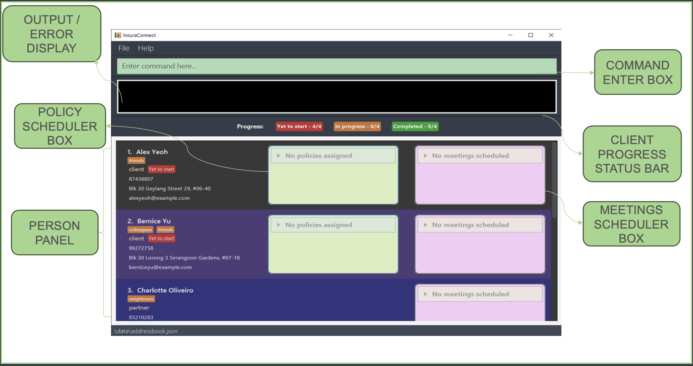
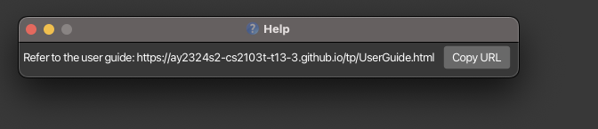
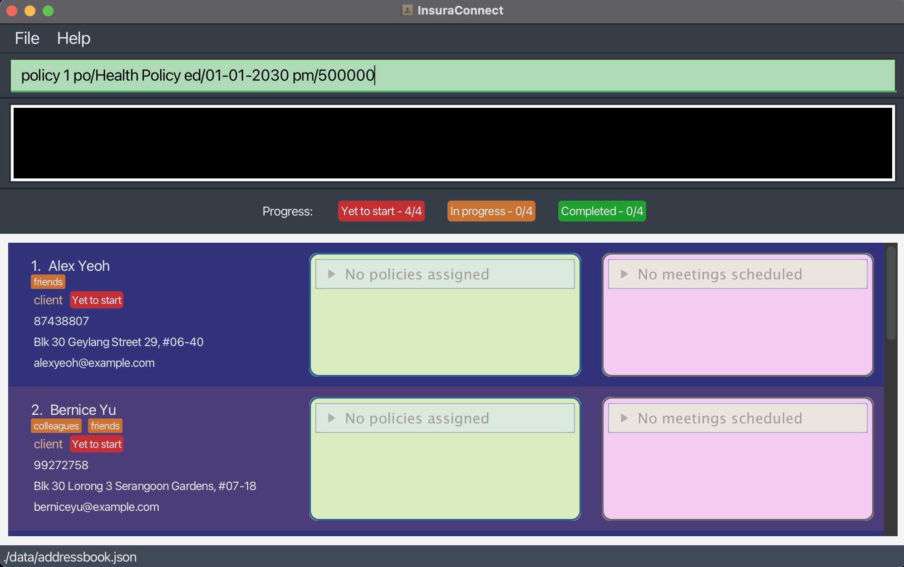
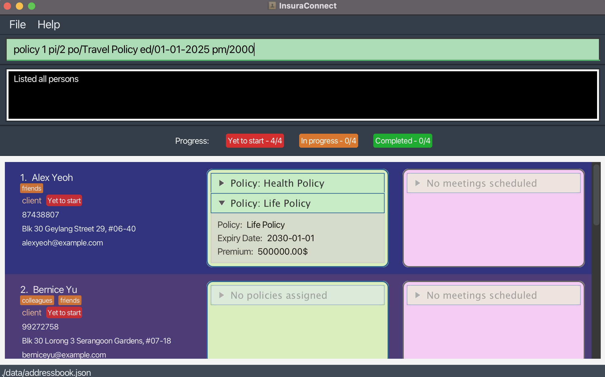
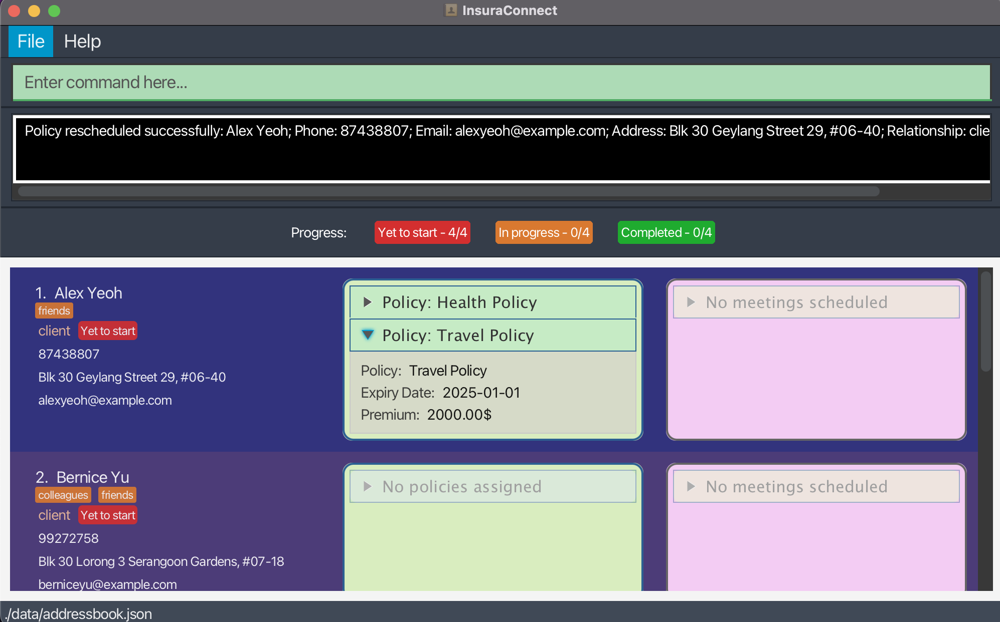
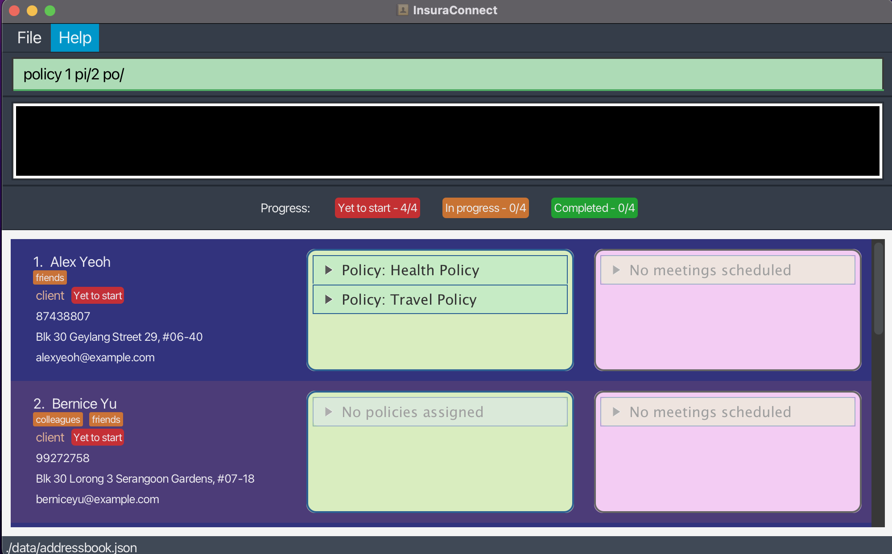
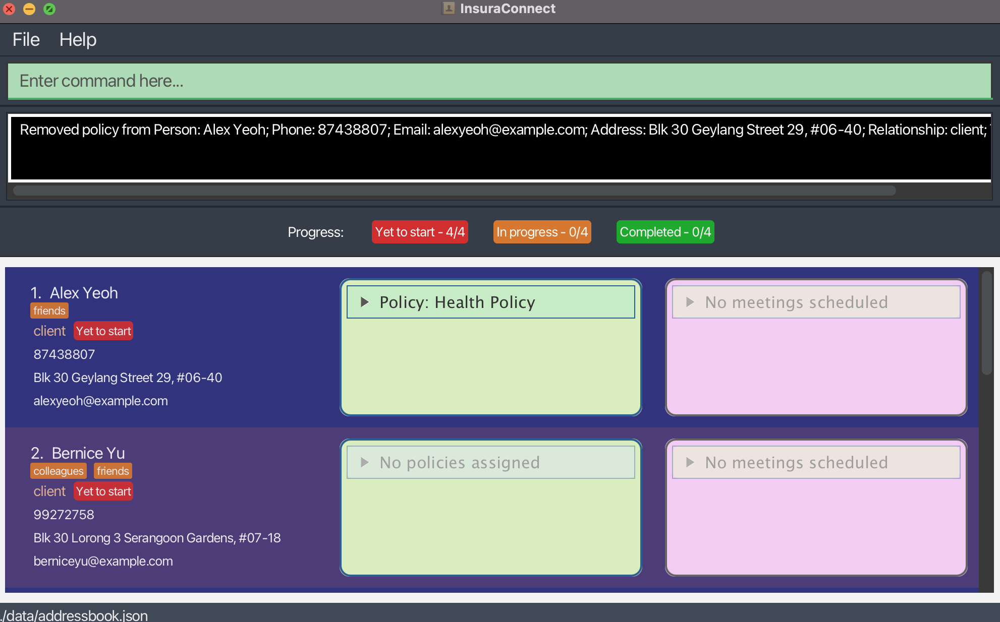
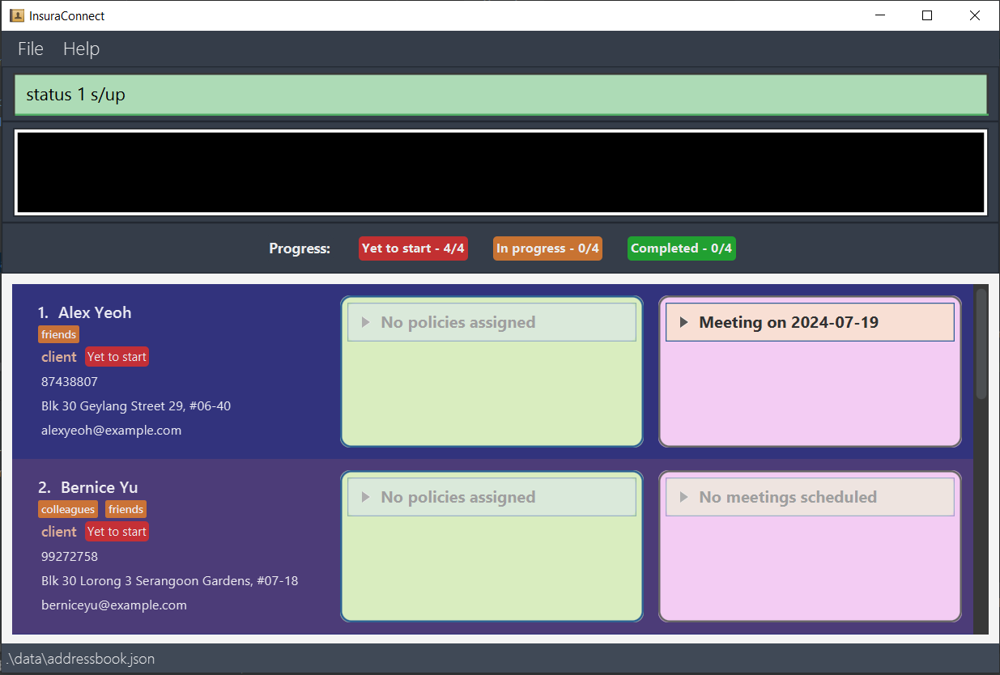
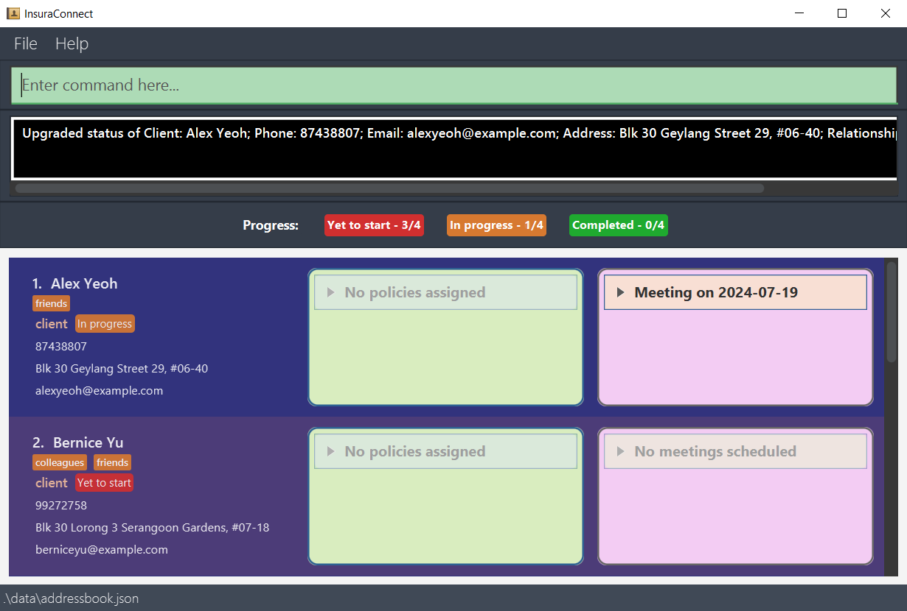
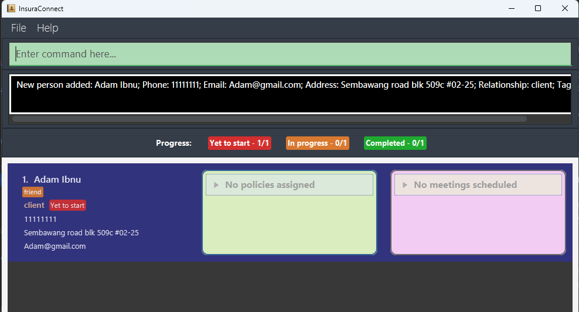

# 
User Guide for InsuraConnect

 

 

## Overview

Welcome to InsuraConnect, your streamlined conduit to peak productivity in the insurance sector. Eschewing the complexity of redundant features, InsuraConnect is forged from in-depth research to deliver a swift, efficient, and user-friendly experience for the modern insurance agent.

## What It Does

InsuraConnect is a **desktop application tailored for managing client interactions and insurance policies**. It is optimized for speed via a **Command Line Interface** (CLI), backed by the visual accessibility of a **Graphical User Interface** (GUI). For agents adept at typing, InsuraConnect enhances task execution, outpacing conventional GUI applications.

With InsuraConnect, you can swiftly access client information, manage policies, track meetings, and stay organized in a competitive landscape. Our goal is to transform your workflow into an efficient model of productivity.

This user guide is crafted to provide installation process, clear explanations for each command, step-by-step instructions, insightful examples and troubleshooting recommendations to ensure you harness the full potential of InsuraConnect. In addition, the quick start guide provides an end-to-end setup process to get started.

## Target Users

InsuraConnect is designed for insurance agents who desire the efficacy of CLI without relinquishing GUI advantages. It's an essential tool for those who manage a **broad client base, track multiple insurance policies, organise meetings**, and value the efficiency of their time and resources.

Refer to the table of contents to find your answers as well as step-by-step instructions for all the features to be a **master** of InsuraConnect.
<!-- * Table of Contents -->

<page-nav-print />

---

## What can InsuraConnect do for you?

:question: What really makes InsuraConnect standout?
This is but the tip of the iceberg of the things you can do working with InsuraConnect.

**Comprehensive Policy Management:** Dive into the essence of each policy with InsuraConnect's in-depth tracking system. Visualize expiry dates, premiums, and detailed coverage information, all laid out for clear understanding and quick access.

**Dynamic Policy Administration:** Add zest to policy handling with agile tools that allow you to add, update, or remove policy details effortlessly. Maintain accurate client portfolios with just a few intuitive commands.

**Streamlined Meeting Coordination:**  Command your schedule with robust scheduling capabilities. Organize, adjust, and cancel meetings with ease, enhanced by our integrated agenda setting and comprehensive note-taking tools.

**Client Engagement Tracker** Keep your finger on the pulse of client relations. Monitor interactions and gauge policy engagement levels to ensure high client retention and satisfaction rates.

**Proactive Meeting Reminders:** Stay ahead of the game with proactive notifications for impending meetings, ensuring you're always prepared to seize every client engagement opportunity.

To explore more, visit [this section](#features) for more advanced tips.

---

## Quick start

1. Ensure you have Java `11` or above installed in your Computer. You can download Java `11` for your system [here](https://www.oracle.com/sg/java/technologies/javase/jdk11-archive-downloads.html).

2. Download the latest `InsuraConnect.jar` from [here](https://github.com/AY2324S2-CS2103T-T13-3/tp/releases).

3. Copy the file to the folder you want to use as the _home folder_ for InsuraConnect.

4. Open a command terminal, `cd` into the folder you put the jar file in, and use the `java -jar InsuraConnect.jar` command to run the application. 
A GUI similar to the below should appear in a few seconds. Note how the app contains some sample data. 
 
   
 

5. Type the command in the command box and press Enter to execute it. e.g. typing **`help`** and pressing Enter will open the help window. 
   Some example commands you can try:

   * `list` : Lists all contacts.

   * `add n/John Doe p/98765432 e/johnd@example.com a/John street, block 123, #01-01 r/client` : Adds a contact named `John Doe` to InsuraConnect.

   * `delete 3` : Deletes the 3rd contact shown in the current list.

   * `schedule 1 md/2024-05-05 mt/09:00 ma/Discuss health policy mdur/60` : Schedules a meeting with the first contact in the current list at 5th may 2024 9am to discuss health policy.
   * `policy 1 po/Health policy ed/2029-06-06 pm/1000` Adds a policy with the first contact in the current list with name of 
   Health policy, expiry date on the 6th of June 2029, with a premium of 1000 SGD

   * `exit` : Exits the app.

6. Refer to the [Features](#features) below for further details of each command.
7. Refer to the [Command Summary](#command-summary) for a full list of the available commands

--------------------------------------------------------------------------------------------------------------------

## Before you start

**Notes about the command format:** 

* Words in `UPPER_CASE` are the parameters to be supplied by the user. 
  e.g. in `add n/NAME`, `NAME` is a parameter which can be used as `add n/John Doe`.
* Prefixes are in the form of a shortened word followed by a / such as `po/` for policy or`md/` for meeting date. 
* Prefixes require a space before being used, such as `n/NAME e/EMAIL` requiring a space between `NAME` and `e/`.

* Items in square brackets are optional. 
  e.g. `n/NAME [t/TAG]` can be used as `n/John Doe t/friend` or as `n/John Doe`.
  e.g. `po/POLICY_NAME [ed/EXPIRY_DATE]` can be used as `po/Policy_ABC ed/01-01-2025` or as `po/Policy_ABC` .

* Items with `…`​ after them can be used multiple times including zero times. 
  e.g. `[t/TAG]…​` can be used as ` ` (i.e. 0 times), `t/friend`, `t/friend t/family` etc.

* Parameters can be in any order. 
  e.g. if the command specifies `n/NAME p/PHONE_NUMBER`, `p/PHONE_NUMBER n/NAME` is also acceptable.

* Extraneous parameters for commands that do not take in parameters (such as `help`, `list`, `exit` and `clear`) will be ignored. 
  e.g. if the command specifies `help 123`, it will be interpreted as `help`.

* If you are using a PDF version of this document, be careful when copying and pasting commands that span multiple lines as space characters surrounding line-breaks may be omitted when copied over to the application.

***

## Features

### Viewing help : `help`

Shows a message explaining how to access the help page.

Format: `help`

### Adding a person: `add`

Adds a person to InsuraConnect.

Format: `add n/NAME p/PHONE_NUMBER e/EMAIL a/ADDRESS r/RELATIONSHIP [t/TAG]…​`

<box type="tip" seamless>

**Tip:** A person can have any number of tags (including 0)
and the tag names should not have whitespaces in them.
</box>

<box type="warning" seamless>

**Constraints:** 
* The relationship field can only be `client` or `partner`.
* Names can only consist of alphanumeric characters, regarding names that include special characters such as `s/o`,
  unfortunately it is currently not allowed. However, it is one of our considerations in our future [planned enhancements](#planned-enhancements)  and for now, a current workaround would be directly using "son of" or "so" instead.
* Currently, we perform checks for duplicate contacts by comparing names, so we are unable to have multiple contacts with the same name. However, we plan to include more stringent validity checks in the future [planned enhancements](#planned-enhancements).
* Phone numbers can start with an optional + sign followed by the country code 
then followed by the compulsory phone number, example :`p/+6590011040` or `p/90011040`
* Email has to be of the format local-part@domain 
and adhere to the following constraints:
  1. The local-part should only contain alphanumeric characters and these special characters, excluding 
the parentheses, (+_.-). The local-part may not start or end with any special characters.
  2. This is followed by a '@' and then a domain name. The domain name is made up of domain labels separated by periods.
  3. The domain name must:
      - end with a domain label at least 2 characters long
      - have each domain label start and end with alphanumeric characters 
      - have each domain label consist of alphanumeric characters, separated only by hyphens, if any.
</box>

Examples:
* `add n/John Doe p/98765432 e/johnd@example.com a/John street, block 123, #01-01 r/client` adds a client with the respective details to InsuraConnect.
* `add n/Betsy Crowe t/friend e/betsycrowe@example.com a/Kent Ridge p/1234567 r/partner t/oweMoney` adds a partner with the respective details to InsuraConnect.

### Listing all persons : `list`

Shows a list of all persons in InsuraConnect.

Format: `list`

### Editing a person : `edit`

Edits an existing person in InsuraConnect.

Format: `edit INDEX [n/NAME] [p/PHONE] [e/EMAIL] [a/ADDRESS] [t/TAG]…​`

* Refer to the above [add](#adding-a-person--add) section for constraints for the values.
* Edits the person at the specified `INDEX`. The index refers to the index number shown in the displayed person list. The index **must be a positive integer** 1, 2, 3, …​
* At least one of the optional fields must be provided.
* Existing values will be updated to the input values.
* Editing the relationship is not allowed.
* Editing the policy and meeting fields will be through other commands, [policy](#editing-a-policy-of-a-client) and [reschedule](#rescheduling-a-meeting-with-a-person--reschedule) respectively.
* When editing tags, the existing tags of the person will be removed i.e. adding of tags is not cumulative.
* You can remove all the person’s tags by typing `t/` without
    specifying any tags after it.

Examples:
*  `edit 1 p/91234567 e/johndoe@example.com` edits the phone number and email address of the 1st person to be `91234567` and `johndoe@example.com` respectively.
*  `edit 2 n/Betsy Crower t/` edits the name of the 2nd person to be `Betsy Crower` and clears all existing tags.

### Locating persons by name, relationship, tag, policy: `find`

Finds persons whose details contain any of the given keywords.

Format: `find [n/NAME]... [r/RELATIONSHIP]... [t/TAG]... [po/POLICY]...`

* The search is case-insensitive. e.g `hans` will match `Hans`.
* The keywords (`NAME`, `RELATIONSHIP`, `TAG`, `POLICY`) cannot contain spaces between words e.g: `Hans Bo`, `owe money` are not allowed.
* Keywords containing white spaces at the beginning or end are allowed. e.g: ` Hans`, `client `.
* The keywords cannot be empty e.g: `find n/`.
* You can search by name, relationship, tags or policy.
* Only full words will be matched e.g. `Han` will not match `Hans`.
* Persons matching at least one keyword in any attribute will be returned (i.e. `OR` search).
  e.g. find n/Hans n/Bo r/partner will return `Hans Gruber`, `Bo Yang` and all person who have relationship `partner`.

Examples:
* `find n/ John` returns `john` and `John Doe`
* `find r/partner` returns `Alex Yeoh`, `David Li`
 

### Deleting a person : `delete`

Deletes the specified person from InsuraConnect.

Format: `delete INDEX`

* Deletes the person at the specified `INDEX`.
* The index refers to the index number shown in the displayed person list.
* The index **must be a positive integer** 1, 2, 3, …​

Examples:
* `list` followed by `delete 2` deletes the 2nd person in InsuraConnect.
* `find Betsy` followed by `delete 1` deletes the 1st person in the results of the `find` command.

### Policy
<box type="warning" seamless>

**Constraints:**
* Format of expiry date is `dd-mm-yyyy` e.g: `31-12-2025` and it should not be a past date.
* Value of premium should be larger than 0.
* The maximum policies per person is 5.
* Only clients can be assigned a policy. Attempts to assign a policy to a partner will be denied.
</box>

### Adding a policy to a client: `policy`
Format: `policy INDEX po/POLICY_NAME [ed/EXPIRY_DATE] [pm/PREMIUM]`

* Assigns a policy to the client at the specified `INDEX`. 
The index refers to the index number shown in the displayed person list. The index **must be a positive integer** 1, 2, 3, …​

Examples: `policy 1 po/Health Policy ed/01-01-2030 pm/500000` adds a new policy to the 1st person.
  

*Before adding a policy*
 

*After adding a policy to the first person*

### Editing a policy of a client: `policy`
Format: `policy INDEX pi/POLICY_INDEX po/POLICY_NAME [ed/EXPIRY_DATE] [pm/PREMIUM]`

* Edits a policy assigned to the client at the specified `INDEX` with a specified `POLICY INDEX`. 
Policy index refers to the index number shown in the person's displayed policy list. Both index **must be a positive integer** 1, 2, 3, …​

Examples: `policy 1 pi/2 po/Travel Policy ed/01-01-2025 pm/2000` edits the 1st person's 2nd policy.

*Before editing the policy*

*After editing the 2nd policy of the 1st person*

### Deleting a policy from a client: `policy`
Format: `policy INDEX pi/POLICY_INDEX po/`

* Deletes a policy assigned to the client at the specified `INDEX` with a specified `POLICY INDEX`.
Both `INDEX` and `POLICY_INDEX` **must be a positive integer** 1, 2, 3, …​
* Leave the `POLICY_NAME` blank to remove a particular policy from a particular client.
* Note that any information provided after `po/` will be ignored and the policy will still be deleted,
e.g., `policy 1 pi/2 po/ ed/01-01-2025 pm/2000` will still delete the 1st person's 2nd policy.
  
Examples: `policy 1 pi/2 po/` deletes the 1st person's 2nd policy.

*Before deleting the policy*
 

*After deleting the 2nd policy of the 1st person*

### Meeting
* Meeting date and time must not be in the past, or after 1 year in the future
* Meeting date and time and duration must not overlap with previous meeting dates and times and duration
* There should not be more than 5 meetings for any clients
* Multiple classical date formats are accepted for further convenience as listed below with examples for `DATE`:
  * yyyy-mm-dd i.e. 2024-12-30
  * yyyy mm dd i.e. 2024 12 30
  * dd mm yyyy i.e. 30 12 2024
  * dd-mm-yyyy i.e. 30-12-2024
* Days of week are also accepted for dates for even more convenience
  * Examples: Mon or Monday (*first letter needs to be capitalised*)
  * This chooses the nearest next occurrence of the day i.e
    current day and time is Monday 05:00, selecting Mon for `DATE` and 04:59 for `TIME` will choose 
    next weeks' monday while choosing 05:01 for `TIME` instead will choose the current monday at 05:01.

#### Scheduling a meeting with a person: `schedule`

Schedules a meeting with a person with an agenda and duration with optional notes

Format: `schedule INDEX md/DATE mt/TIME mdur/DURATION ma/AGENDA mn/[NOTES]`

* Schedules meeting with a person at the specified INDEX. The index refers to the index number shown in the displayed persons list.
* Meeting can only be scheduled if it does not exist in the past and does not overlap with any of the existing meetings.
* Meeting notes are optional and can be used to represent any additional information that might be useful for the meeting.

#### Rescheduling a meeting with a person: `reschedule`

Reschedules a meeting with a person

Format: `reschedule INDEX mi/MEETING INDEX md/DATE mt/TIME `

* Reschedules meeting with a person at the specified INDEX. The index is the same as the above for schedule.
* Selects a meeting from the list of meeting using the MEETING INDEX

#### Cancelling a meeting with a person: `cancel`

Cancels a meeting with a person

Format: `cancel INDEX mi/MEETING INDEX`

* INDEX and MEETING INDEX is the same as the above for reschedule

### Managing Meetings

#### Meeting Scheduling and Rescheduling

Meetings are automatically sorted by their scheduled dates and times. When multiple meetings are scheduled for a client, InsuraConnect will organize them in ascending order, showing the earliest upcoming meeting at the top. This feature allows insurance agents to quickly glance at their schedule and prioritize upcoming meetings.

#### Automatic Purging of Expired Meetings

To ensure the schedule remains current and manageable, InsuraConnect automatically purges past meetings. Once a meeting's end time has passed, it will be removed from the system during the next refresh cycle. This helps to maintain an up-to-date schedule for users, focusing only on relevant future engagements.

#### Sorting Clients/Partners by Earliest Meeting

Clients and partners are sorted in the user interface according to the time of their earliest scheduled meeting. This sorting mechanism places those individuals with the most imminent meetings at the top of the list, allowing for efficient time management and planning. Should there be no scheduled meetings for a client or partner, they will be positioned in the list based on the default sorting criteria.

 

### Changing a client's status: `status`

Changes a client's status by one level to reflect the progress with that client. In increasing order, the possible status levels are `Yet to start`,
`In progress`, and `Completed`.

Format: `status INDEX s/DIRECTION`

* Changes the status of the client at the specified `INDEX`.
  The index refers to the index number shown in the displayed person list. The index **must be a positive integer** 1, 2, 3, …​
* Input `DIRECTION` as `up` to increase the status, or `down` decrease the status.
* Leave the direction blank to reset the client's status to `Yet to start`.

<box type="tip" seamless>

**Tip:** You can use this whenever you schedule the first meeting with your client or assign them a policy to track your progress.
The dashboard above the persons list automatically displays the number of clients that are currently at each status for your convenience.
</box>

<box type="warning" seamless>

**Constraints:**
* You can only change the status of clients. Attempts to change the status of partners are not allowed.
* `DIRECTION` can only be `up`, `down`, or blank.
</box>

Examples:
* `status 1 s/up` increases the status of the 1st person by one level if it is a client.
* `status 1 s/` resets the status of the 1st person if it is a client.

*Before increasing the 1st client's status*
 

*After increasing the 2nd client's status*

 

### Undoing a command: `undo`

Undoes a previous command.

Format: `undo`

* Only undoes commands that made changes to InsuraConnect

Examples:
* `add n/Adam Ibnu p/11111111 e/Adam@gmail.com a/Sembawang road blk 509c #02-25 r/client t/friend`as shown in the figure below adds the adam contact.

* The previous add command is followed by `undo` which undoes the previous command, removing the newly added person as shown below.

### Redoing a command: `redo`

Redoes a previous undid command

Format: `redo`

* Requires a successful prior undo command to redo
  
Examples:

* This example performs redo after the success undo in the above section [Undo](#undoing-a-command--undo)
* Executing redo reapplies the actions that were previously undone which in this example is adding back Adam in the figure below and a successful redo will show a corresponding successful message as well.
  

### Clearing all entries : `clear`

Clears all entries from InsuraConnect.

Format: `clear`

### Exiting the program : `exit`

Exits the program.

Format: `exit`

### Saving the data

InsuraConnect data are saved in the hard disk automatically after any command that changes the data. There is no need to save manually.

### Editing the data file

InsuraConnect data are saved automatically as a JSON file `[JAR file location]/data/addressbook.json`. Advanced users are welcome to update data directly by editing that data file.

<box type="warning" seamless>

**Caution:**
If your changes to the data file makes its format invalid, InsuraConnect will discard all data and start with an empty data file at the next run.  Hence, it is recommended to take a backup of the file before editing it. 
Furthermore, certain edits can cause InsuraConnect to behave in unexpected ways (e.g., if a value entered is outside the acceptable range). Therefore, edit the data file only if you are confident that you can update it correctly.
</box>

### Archiving data files `[coming in v2.0]`

_Details coming soon ..._

--------------------------------------------------------------------------------------------------------------------

## FAQ

**Q**: How do I transfer my data to another Computer? 
**A**: Install the app in the other computer and overwrite the empty data file it creates with the file that contains the data of your previous InsuraConnect home folder.

**Q**: Can I access InsuraConnect from multiple devices? 
**A**: Currently, InsuraConnect is designed to be installed and used on a single computer. However, we are exploring options for multi-device access in future updates.

**Q**: Is InsuraConnect compatible with all operating systems? 
**A**: InsuraConnect is optimized for Windows, macOS, and Linux operating systems. Ensure your device meets the minimum system requirements for seamless performance.

**Q**: Can I import existing client data into InsuraConnect? 
**A**: Currently, there is no direct import feature within InsuraConnect. However, you can manually input your client data using the add command or directly edit the JSON data file if you have a large dataset. We are considering adding import functionality in future updates.

**Q**: Is my data secure within InsuraConnect? 
**A**: InsuraConnect prioritizes data security and confidentiality. All client data is stored locally on your computer in a JSON file and is not transmitted over the internet. However, it's advisable to take regular backups of your data to prevent loss in case of unforeseen circumstances.

--------------------------------------------------------------------------------------------------------------------

## Known issues

1. **When using multiple screens**, if you move the application to a secondary screen, and later switch to using only the primary screen, the GUI will open off-screen. The remedy is to delete the `preferences.json` file created by the application before running the application again.
2. **When scrolling through Meetings and Policy Accordion**, if you scroll too quickly, the cells take some time to render and display the required information.
3. **After using find command**, use `list` to list all tasks so that all operations are done on the correct index number. The filtered list doesn't revert back when doing next command, so user has to manually enter `list` to avoid any discrepancies.

--------------------------------------------------------------------------------------------------------------------

## Supported prefixes

| **Name of prefix**                                 | **Prefix in command** | **Description**                 |
|----------------------------------------------------|-----------------------|---------------------------------|
| Name                                               | n/                    | The name of the person          |
| Phone Number                                       | p/                    | The phone number of the person  |
| Email Address                                      | e/                    | The email address of the person |
| Address                                            | a/                    | The address of the person       |
| Relationship                                       | r/                    | The relationship of the person  |
| Tag                                                | t/                    | The tag of the person           |
| Policy Name                                        | po/                   | The name of the policy          |
| Policy Index                                       | pi/                   | The index of the policy         |
| Policy Expiry Date                                 | ed/                   | The expiry date of the policy   |
| Policy Premium                                     | pm/                   | The premium of the policy       |
| Meeting Date                                       | md/                   | The date of the meeting         |
| Meeting Time                                       | mt/                   | The time of the meeting         |
| Meeting Duration                                   | mdur/                 | The duration of the meeting     |
| Meeting Agenda (not editable through `reschedule`) | ma/                   | The agenda of the meeting       |
| Meeting Notes                                      | mn/                   | The notes of the meeting        |

## Command summary

Action     | Format, Examples
-----------|-----------------------------------------------------------------------------------------------------------------------------------------------------------------
**Help**   | `help`
**Add**    | `add n/NAME p/PHONE_NUMBER e/EMAIL a/ADDRESS r/RELATIONSHIP [t/TAG]…​`   e.g., `add n/James Ho p/22224444 e/jamesho@example.com a/123, Clementi Rd, 1234665 r/client t/friend`
**List**   | `list`
**Edit**   | `edit INDEX [n/NAME] [p/PHONE_NUMBER] [e/EMAIL] [a/ADDRESS] [t/TAG]…​`  e.g.,`edit 2 n/James Lee e/jameslee@example.com`
**Find**   | `find [n/NAME]... [r/RELATIONSHIP]... [t/TAG]... [po/POLICY]... `   e.g., `find n/John n/Alex r/client`
**Delete** | `delete INDEX`  e.g., `delete 3`
**Add Policy** | `policy INDEX po/POLICY_NAME [ed/EXPIRY_DATE] [pm/PREMIUM]`   e.g., `policy 1 po/Policy ABC ed/01-01-2025`
**Edit Policy** | `policy INDEX pi/POLICY_INDEX po/POLICY_NAME [ed/EXPIRY_DATE] [pm/PREMIUM]`   e.g., `policy 1 pi/2 po/Policy ABC pm/1000`
**Delete Policy** | `policy INDEX pi/POLICY_INDEX po/`   e.g., `policy 2 pi/2 po/`
**Schedule Meeting**   | `schedule INDEX md/DATE mt/TIME mdur/DURATION ma/AGENDA [mn/NOTES]`   e.g., `schedule 1 md/2024-05-05 mt/09:00 mdur/60 ma/Discuss health policy mn/Bring laptop`
**Reschedule Meeting**   | `reschedule INDEX mi/MEETING_INDEX md/DATE mt/TIME`   e.g., `reschedule 1 mi/1 md/2024-07-07 mt/11:00`
**Cancel Meeting**   | `cancel INDEX mi/MEETING_INDEX`   e.g., `cancel 1 mi/1`
**Change Client Status** | `status INDEX s/DIRECTION`   e.g., `status 1 s/up`
**Undo**   | `undo`
**Redo**   | `redo`
**Clear**  | `clear`
**Exit**  | `exit`
