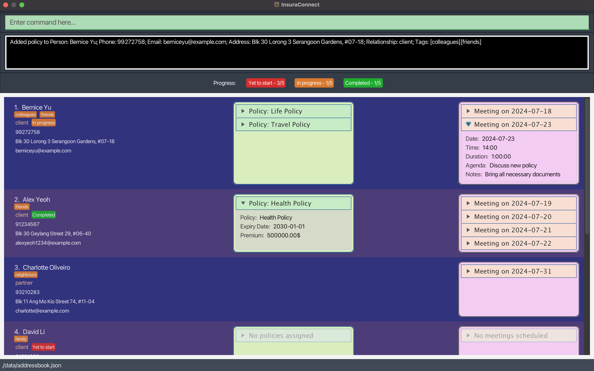

# InsuraConnect

**InsuraConnect is an enhanced version of the AddressBook-Level3 project, which serves as a personal contact management tool for insurance agents.**
* It provides fast access to client contact details, easily manage client relationships, collaborate with industry partners, and stay organised in a fast-paced industry.
* If you are interested in using InsuraConnect, head over to the [_Quick Start_ section of the **User Guide**](UserGuide.html#quick-start).
* If you are interested about developing InsuraConnect, the [**Developer Guide**](DeveloperGuide.html) is a good place to start.

**Acknowledgements**

* Libraries used: [JavaFX](https://openjfx.io/), [Jackson](https://github.com/FasterXML/jackson), [JUnit5](https://github.com/junit-team/junit5)
